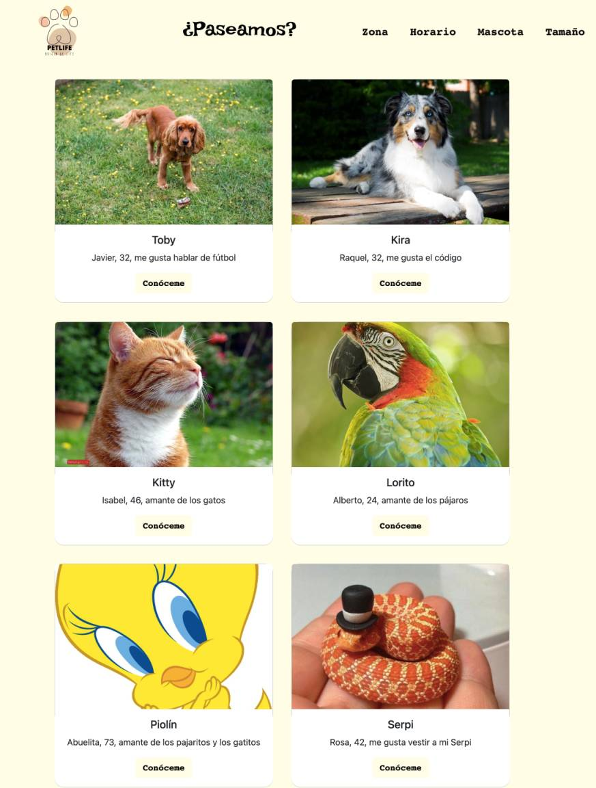

# Hackathon 2022

## ¿Paseamos? frontend

Our frontend for the hackathon 2022 fullstack app.



## Team

Hi there!

- Adrián: https://github.com/adrianmoratilla
- Jesús: https://github.com/checkmyprojects
- Jordi: https://github.com/JordiGDavant
- María Angélica https://github.com/MariangelicaCarvallo
- Mario Rubio https://github.com/marioastur
- Marina https://github.com/Yelose
- Sara: https://github.com/Saracode13
- Taoufik:https://github.com/taoufikL12

## How It's Made:

**Tech used:** HTML5, CSS3, Angular, Typescript, Bootstrap.

## How to install

Clone repo

```npm install```

```ng serve```

Open your web browser on http://localhost:4200

## Optimizations

- Code needs some refactoring and clean up.

- More views and a search box.

## Lessons Learned:

A good planning helps speed things up.


